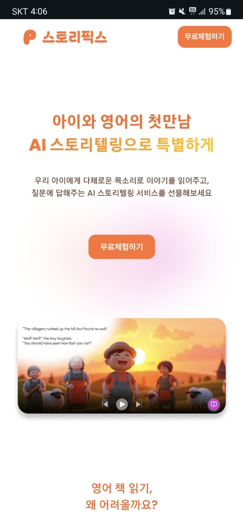
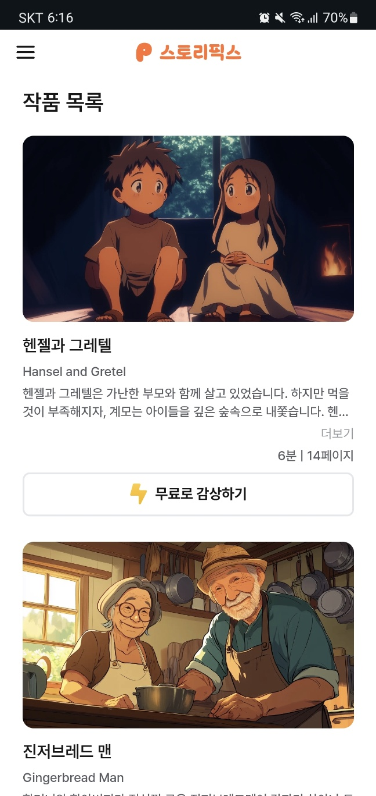
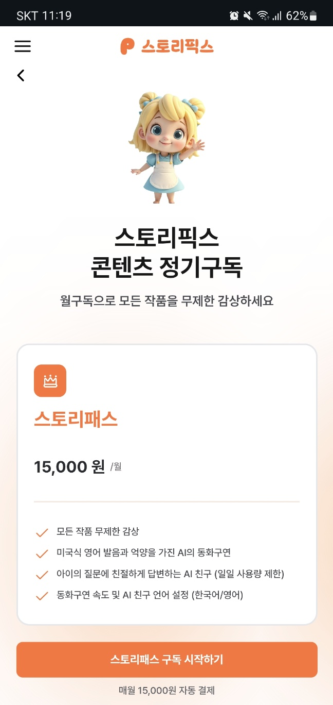

<br/>

## 🍳 스토리픽스

### AI와 함께하는 영어 동화 학습

<div>우리 아이에게 다채로운 목소리로 동화를 구연하고 <br /> 질문에 답해주는 AI 동화 서비스를 선물하세요</div>

## 💻 서비스 소개

### 서비스 화면

<table>
  <tr>
    <td align="center">
      <br>
      <span>랜딩 페이지</span>
    </td>
    <td align="center">
      <br>
      <span>리스트 페이지</span>
    </td>
    <td align="center">
      <br>
      <span>구독 페이지</span>
    </td>
  </tr>
</table>


<br/><br/>

### 동화 구연

유저가 플레이어 화면을 터치하여 재생 컨트롤러 버튼을 열어, 재생/일시정지, 문장/페이지 이동, 재생 속도, ai 응답 언어 설정을 할 수 있습니다.

https://github.com/user-attachments/assets/e828aa33-9bd4-4a82-9ee2-889a7c992342


<br/><br/>

### AI 질문하기

유저가 질문하기 버튼을 클릭하여 일정 횟수 ai에게 동화 관련 질문 및 영어 질문을 할 수 있습니다.


https://github.com/user-attachments/assets/ca2bc41a-3faf-4d2b-9813-076e71279435


<br/><br/>

## 🔨 기술 스택

<div style="display: flex;">


</div>

<br/><br/>

## ⌨️ 개발 내용

### 1️⃣ OpenAI Realtime API를 활용한 WebRTC 기반 실시간 음성 질의응답 시스템 구축

클라이언트와 OpenAI Realtime API 간의 WebRTC 양방향 오디오 스트리밍 통신을 직접 구현했습니다.
서버는 유저 세션을 검증한 후 OpenAI로부터 ephemeral key를 발급받아 HTTPS로 전달하며,<br>
클라이언트는 키를 로컬에 저장하지 않고 매 세션마다 갱신 요청하도록 설계했습니다.

브라우저의 마이크 입력을 실시간으로 캡처해 전송하고, AI가 생성한 음성 응답을 지연 없이 재생할 수 있도록 구성했습니다.

이 기능은 실제 서비스 환경에서 운영되며, 유저가 AI와 자연스럽게 실시간 음성 질의응답을 주고받을 수 있는 대화형 경험을 제공합니다.<br><br>

### 2️⃣ 동화 구연 서비스 (AI 음성 + 이미지 + 텍스트)

백엔드 서버로부터 동화 데이터를 페이지 단위로 비동기 요청(음성, 이미지, 텍스트)하여 유저에게 제공합니다.
이미지는 WebP 포맷으로 변환하고 Lazy Loading을 적용해 LCP를 개선했으며,<br>
텍스트·오디오 데이터는 서버에서 그대로 전달받아 클라이언트에서 파싱 및 렌더링했습니다.

플레이어 화면에서 재생/일시정지, 문장 및 페이지 이동, 재생 속도 조절, AI 응답 언어 설정이 가능하도록 UI를 직접 구현했습니다.

특히 다음 페이지 데이터를 비동기로 미리 불러오는 프리로딩 구조를 통해 초기 로딩 속도를 약 60% 개선했습니다.
(동화 구연: 최초 3페이지 로드 후 페이지 이동 시마다 1페이지씩 추가 요청)

해당 기능은 실제 유저가 사용하는 서비스에 배포되어, AI가 읽어주는 동화를 들으며 상호작용할 수 있는 환경을 완성했습니다.<br><br>


### 3️⃣ OAuth 2.0 기반 카카오 로그인 및 인증 시스템 구축

카카오 OAuth 2.0 API를 활용해 카카오 계정을 통한 로그인 및 회원가입 기능을 직접 구현했습니다.

로그인 후 액세스 토큰(HttpOnly + Secure쿠키)과 리프레시 토큰을 관리하여, 새로고침이나 재방문 시에도 로그인 상태가 유지되도록 설계했습니다.

또한 Next.js middleware에서 /users/me API를 통해 인증 여부를 검증해<br>
로그인하지 않은 사용자는 자동으로 로그인 페이지로 리디렉션하도록 처리했습니다.
실제 배포 환경에서 세션 유지 및 재로그인 플로우가 안정적으로 동작함을 확인했습니다.<br><br>


### 4️⃣ 레몬스퀴지(Lemon Squeezy) 구독 결제 시스템 연동

lemon.js를 직접 임베드하여, 프론트엔드 단에서 결제 플로우 전반을 구현했습니다.

유저가 결제 정보를 입력하고 결제가 완료되면, 백엔드와 통신하여 구독 상태를 즉시 업데이트하도록 설계했습니다.

이후 Zustand로 결제 상태를 관리해 결제 완료 후 UI에 실시간 반영되도록 구성했습니다.

실제 유저 결제 환경에서 테스트 및 운영이 이루어졌으며, 결제 후 즉시 서비스 이용이 가능하도록 최종 배포했습니다.<br><br>


## 폴더구조

```
📦 src
 ┣ 📂 app                # 페이지 라우팅 및 레이아웃 관리 (Next.js App Router)
 ┣ 📂 components         # 재사용 가능한 UI 컴포넌트 모음
 ┣ 📂 services           # API 호출 및 비즈니스 로직 분리
 ┣ 📂 store              # Zustand를 활용한 전역 상태 관리
 ┣ 📂 hooks              # 커스텀 훅 (GA 추적, 스크롤 제어 )
 ┣ 📂 utils              # 공통 유틸리티 함수
 ┣ 📂 animation / fonts  # 애니메이션 JSON 및 폰트 리소스
 ┗ 📜 middleware.ts      # 인증 및 리디렉션 처리

 ```
